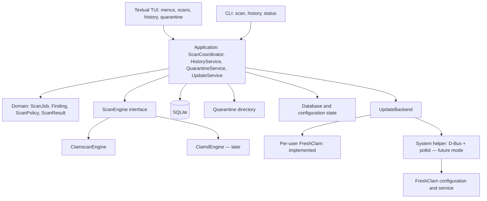

# ClamUI architecture for Linux Mint

Status: target architecture. The current prototype is reduced; see the
[README](../README.md). It uses standard-library curses rather than Textual and a
combined `core.py` module. System mirror management and later stages
are not implemented. Basic quarantine, restore, manual deletion, and an exact-path
allowlist are implemented in the working tree. The staged operation journal and
crash recovery described below remain planned; current restore returns saved
permissions, including executable bits, and supports only the original path.
Prototype 0.2 includes file selection, path completion,
fixed-list progress, per-user FreshClam updates, and English/Russian UI strings.
The system backend below is a separate future mode.

Assumption: ClamUI is a menu-driven ClamAV terminal frontend (TUI) with CLI
commands. The initial target is Linux Mint 22.x across Cinnamon, MATE, and Xfce.
SSH support requires a terminal compatibility check; LMDE needs a separate support
matrix.

## Goals and scope

Scan selected files and directories, show clear results and history, provide
user-managed quarantine, and report database status and updates with mirror
selection. **Private mirrors only** disables official sources and automatic
fallback. The application works locally without a cloud service or telemetry.
On-access protection, root-wide scans, and automatic threat deletion are outside
the first release.

## Technology choices

| Area | Choice | Reason |
|---|---|---|
| Language | Distribution Python 3 | Integrates with system libraries |
| Interface | Python + Textual (target design) | Terminal menus, tables, forms, keyboard navigation |
| CLI | argparse | Automation and non-interactive use |
| MVP engine | `clamscan` subprocess | Does not require a persistent `clamd` daemon |
| Optional engine | `clamd` over a local Unix socket | Repeated scans without reloading databases |
| Data | Standard-library SQLite | Transactions and local history |
| Settings | TOML under XDG_CONFIG_HOME | No desktop-environment dependency |
| Background work | asyncio subprocesses and a disk-operation worker | Keeps process and file I/O off the UI loop |
| Delivery | Native `.deb` | Access to system ClamAV and desktop integration |

A TUI reduces desktop dependence but does not remove library maintenance. In the
target design, Textual stays in the TUI layer and is not imported by the core.
Build dependencies are pinned and tested on the oldest supported system, rather
than assumed compatible from the latest upstream APIs. Flatpak is not the primary
format: host-file and system-daemon access need a separate integration design.

## Components



This is a modular terminal application, not an HTTP API or a set of microservices.
In the target design, the TUI runs on the main asyncio loop. An adapter reads the
scanner process asynchronously; blocking file operations and SQLite work run in a
dedicated worker. The SQLite connection is created and used only in that worker.
Core events become Textual messages at the TUI boundary, with update frequency
limited. The application owns jobs rather than screens, so opening history does
not cancel a scan. The CLI uses the same use cases without importing Textual.

## Menu and interaction

```text
ClamUI                                  Databases: status / date

  > Scan files or a folder
    Scan history
    Quarantine
    Databases and updates
    Settings
    Help
    Exit

↑↓ Select   Enter Open   Tab Next field   Esc Back   F1 Help
```

Target selection combines a path field with completion and a directory tree, and
supports multiple paths. The scan screen shows phase, available counters, findings,
errors, and cancellation. Every action is keyboard accessible; the mouse is
optional. Destructive actions require a dialog showing the path and operation,
with no preselected confirmation. The target geometry starts at 80×24; smaller
terminals show a resize message while preserving the job. ASCII styling, no-color
mode, and textual status indicators are supported. Paths and scanner messages are
data: control characters are escaped, and input ANSI/OSC sequences or Rich markup
are never executed. Original paths are stored separately from display strings.

Planned commands (not implemented in this form yet):

```sh
clamui                             # menu
clamui scan -- ~/Downloads          # scan without TUI
clamui scan --json -- ~/Downloads   # one JSON result on stdout
clamui history                     # history
clamui status                      # engine and database status
```

CLI codes: 0 means completed with no findings or known skips; 1 means findings
without errors; 2 means an error or incomplete scan, including one with findings;
130 means Ctrl+C cancellation. JSON has separate finding and completeness fields
and an explicit schema version. Diagnostics go to stderr. Running without arguments
and without a TTY prints help. `--no-color` is supported. A non-blocking `flock` in
the private state directory prevents concurrent changing TUI/CLI operations; a
second instance reports that ClamUI is busy. History reads may run separately.

## Scan contract and lifecycle

`ScanEngine` accepts a `ScanRequest` and publishes `ScanStarted`, `FindingDetected`,
`PathFailed`, `ScanProgress`, and `ScanFinished` events. A `capabilities` field
prevents the UI from offering unsupported options. Not all `clamscan` options apply
to `clamd`; daemon configuration belongs to the system.

`ScanRequest` contains an ID, absolute paths, recursion, exclusions, symlink and
mount-point policy, limits, and selected engine. `Finding` contains the original
path, signature name, time, engine, and a file-metadata snapshot. `ScanResult`
contains files checked, findings, errors, skips, duration, engine/database
versions, and an incomplete-coverage flag.

Job states are `queued → running → completed | failed | cancelled`. A detection is
a scan result, not an execution failure. Coverage is tracked separately because a
finished process does not guarantee that every file was checked. Jobs left in
`running` after a crash become `interrupted`.

The MVP runs one job at a time. During a scan the UI shows phase, elapsed time, and
available counters. A percentage appears only when the work count is known; a
recursive scan without a reliable total uses an indeterminate indicator. Exiting
through the menu offers to stay or cancel. Ctrl+C requests cancellation; SIGHUP and
SIGTERM stop ClamUI's scanner and preserve a partial result where possible. After
SIGKILL, the next launch marks the job interrupted. The TUI restores terminal mode
after normal exit and handled exceptions. MVP scans do not continue after the
terminal closes; use tmux for long SSH sessions.

## `clamscan` adapter

- Launch subprocesses with an argument array and no shell; separate paths from
  options with `--`.
- Apply explicit symlink and filesystem traversal policy; do not scan special files.
- Continuously read stdout/stderr and cap diagnostic-log size.
- Use a stable process locale and versioned parser; keep unknown messages as diagnostics.
- Normalize exit codes 0/1/2 to clean / findings / error. Keep findings received
  before a later process error.
- Do not treat text output as a reliable file identity. Unusual names, including
  newlines, need separate handling. An ambiguous line must never authorize moving
  or deleting a file; the UI shows the limitation.
- Cancel by terminating the owned process group, force-killing after a timeout,
  draining remaining output, and saving a partial result.
- Report inaccessible paths, limits, exclusions, and other known skips separately.
  Use the result wording “No threats found in the files that were scanned”.

## Optional `clamd` adapter

Connect only to a local Unix socket and check availability and permissions first.
FILDES, where supported, or INSTREAM can pass an open file so the daemon need not
have path access. The application keeps its own response-to-file mapping, enforces
stream limits, and accounts for scanner restrictions. Cancellation stops sending
new requests; immediate cancellation of a request already running in the daemon is
not guaranteed. Fallback to `clamscan` is allowed only before a job starts and must
show the engine in the UI. An error mid-job must not silently start a second full scan.

## Permissions and database updates

### Implemented per-user backend

The update action runs FreshClam with a temporary configuration in a private
`/tmp/clamui-freshclam-*` directory and a `--datadir` in the same directory. On
Ubuntu/Mint, the FreshClam AppArmor profile permits owner files under `/tmp/**` but
may deny the user's XDG_STATE_HOME. After verification, downloaded data is copied
into staging under XDG_DATA_HOME/clamui and activated with an atomic pointer on the
same filesystem. Saved mirrors apply only to this update. System configuration is
neither read to inherit sources nor modified.

Current databases are copied into staging. FreshClam checks signatures and database
loading, then ClamUI atomically switches the `active-database` pointer on success.
On failure, the prior databases remain active; `freshclam.dat` preserves retry
intervals. Scans receive `--database` with the active directory and use system
databases until the first local update. A shared activity lock prevents scanning
during updates. The UI shows database source, live log, and cancellation.

Scan files are inventoried before `clamscan` receives them through `--file-list`.
Progress counts unique received results; errors and skips remain separate. Unknown
results are never replaced with estimates.

### Future system backend

These requirements apply to management of the shared system service, not to
per-user updates. Backend choice must be explicit; database directories and
configurations must never be mixed.

The TUI and scanner run as the regular user. An inaccessible file becomes a skip;
there is no automatic privilege escalation. Install ClamAV and databases through
the distribution. If databases are missing, disable scanning with a clear reason.
One system FreshClam owns updates; the TUI must not launch a competing process.
Editing a profile needs no root access, but applying it and requesting an update
uses a narrow D-Bus helper protected by polkit. A text authorization agent is
needed for terminals without a graphical agent; otherwise only viewing and draft
editing are available. The TUI never receives or stores an administrator password.
System source settings affect every user, which the UI must state clearly.

### Update model and module boundaries

- `UpdateProfile`: ID, name, mode (`official` / `private_only`), mirrors, automatic
  updates, checks_per_day, connect_timeout, receive_timeout.
- `MirrorEndpoint`: ID, label, base_url, enabled. HTTPS by default; HTTP is allowed
  only when explicitly chosen for a local mirror. Reject userinfo, control
  characters, query/fragment, and unsupported schemes. Mirror authentication is
  outside v1.
- `UpdateService`: draft, validation, preview, apply, update request, status.
  States: `draft → validated → applying → applied | failed`.
- `UpdateBackend`: `read_effective_config`, `validate_profile`, `preview_changes`,
  `apply_profile(expected_revision)`, `request_update`, `get_update_status`.
- `FreshclamConfigAdapter`: version-specific profile-to-directive conversion.
  Unknown versions or unsupported capabilities block application with an explanation.
- `SystemUpdateHelper`: caller and polkit validation, system lock, configuration,
  and management of a fixed service. It accepts no shell commands, arbitrary paths,
  arbitrary directives, `OnUpdateExecute`, or `OnErrorExecute`.
- `UpdateRun`: profile and revision, time, known source, database versions before
  and after, result, and diagnostics. Update events are independent from scan events.

Draft profiles live in user TOML. The applied revision and system-change log live
under root-owned `/var/lib/clamui/`; the effective FreshClam configuration is the
source of truth. The UI distinguishes “saved”, “applied”, and “external changes”
and never presents a saved toggle as the actual system state.

### Source modes

| Mode | FreshClam sources | Behavior if unavailable |
|---|---|---|
| Official | `DatabaseMirror database.clamav.net`, standard DNS check | Fail and preserve existing databases |
| Private mirrors only | Enabled `PrivateMirror` entries only; at least one required | Try other allowed private mirrors, then fail; no official fallback |

The **Official servers: off** toggle means `private_only`. Adding a mirror does not
change the mode. V1 does not support a mixed mode; this avoids ambiguity between a
backup source and fully disabling official sources. Private backups are passed to
FreshClam; the UI does not promise strict order unless the installed FreshClam
version guarantees it.

In `private_only`, the adapter generates `PrivateMirror` instead of `DatabaseMirror`.
`PrivateMirror` overrides `DatabaseMirror`, `DNSDatabaseInfo`, and `ScriptedUpdates`:
official DNS version checks and incremental scripted updates are not used. The
compiled configuration contains no active official `DatabaseMirror`,
`DNSDatabaseInfo`, or extra `DatabaseCustomURL`. Old extra sources appear in the diff
and are disabled when applied, not silently ignored. Do not use `DNSDatabaseInfo no`
as a universal DNS-off command. Ordinary DNS is still needed to resolve the private
mirror's hostname.

Example generated `freshclam.conf` snippet (not a complete system config):

```text
PrivateMirror https://mirror.example.org/clamav
PrivateMirror https://backup.example.org/clamav
```

These addresses are placeholders. URL/path syntax is checked against the installed
version. A mirror must serve compatible ClamAV databases. This selects where signed
databases are downloaded from; it does not authorize arbitrary unsigned signatures.
Database authentication stays enabled. A signature error never bypasses validation
or changes mode. `PrivateMirror` may require full database downloads; explain this
in help.

The mode's guarantee covers the sources, DNS check, and fallback managed by
FreshClam. It is not a system-wide network block: mirror redirects, proxies, or
external service changes can alter the route. A mirror check detects redirects and
rejects cross-origin changes; test FreshClam HTTP redirects separately on target
versions. Until destination network traffic is controlled, do not promise that no
packet can reach official infrastructure. Strict isolation requires an egress
allowlist or controlling proxy; the UI must not call a normal profile a “network
block”. Mirror availability does not prove database authenticity.

### Apply and recovery

1. Validate fields, enabled mirrors, and FreshClam compatibility. Show system-wide
   scope, the diff, and sources that will be disabled.
2. After **Apply**, authorize a fixed operation through polkit. The helper validates
   again, takes the system lock, and checks the revision.
3. Record the previous config and service state; stop the current updater and wait
   for it to exit. Refuse if a single database owner cannot be established.
4. Generate config without arbitrary user directives and validate syntax using a
   method supported by the target version. Write to a temporary file, fsync, then
   atomically replace while preserving system permissions. Do not assume include
   directives are supported.
5. Start the service with the new config and verify effective profile and state.
   “Applied” means the configuration applied successfully, not that databases updated.
6. On failure, never enable official sources automatically. If the prior profile
   violates the new restriction, leave the updater stopped, preserve databases, and
   offer to fix settings or explicitly restore the prior mode. A phase log supports
   recovery if a failure occurs between config replacement and service start.

External config edits or package maintenance are detected by revision. A mismatch
blocks overwrite until reviewed again. The system adapter accounts for Mint/Debian
package ownership; schedules and manual update requests must not create a second
FreshClam. A scan uses its loaded databases to completion; updated `clamd` reloads
databases through its standard mechanism.

## Data and quarantine

- `$XDG_STATE_HOME/clamui/history.sqlite3`: jobs, findings, errors, operation log.
- `$XDG_DATA_HOME/clamui/quarantine/`: quarantined content with opaque UUID names.
- `$XDG_CONFIG_HOME/clamui/config.toml`: preferences, exclusions, scan options.
  Use a versioned schema and atomic temp-file writes. Missing XDG variables fall
  back to standard directories under HOME.
- User-private directories use mode 0700; history and quarantine files use 0600.
- SQLite uses schema migrations; history retention is configurable.

Quarantine requires an explicit user action. Recheck file type and identity before
moving; never follow symlinks. A file changed after scanning must be rescanned. For
archives, the operation applies to the outer archive, not a virtual path inside it.

Operations use the journal `pending → stored → source_removed → committed`. Across
filesystems, first create an exclusive quarantine copy, verify its hash, sync it,
recheck the source, then remove it. If identity or safety cannot be verified, leave
the source in place and mark the operation incomplete. A database and filesystem
cannot share one transaction, so startup recovery uses the journal.

On restore, check the destination directory and filename conflicts; never overwrite
an existing file or automatically restore execute permission. Permanent deletion
needs a separate confirmation. Hard links and already-open descriptors may leave
content accessible: quarantine is not a sandbox and cannot neutralize every copy.
The safe MVP excludes actively changing or untrusted directories.

## Project structure

```text
src/clamui/
  __main__.py
  bootstrap.py              # dependency wiring
  domain/                   # models and rules, no Textual or subprocess
  application/              # use cases, job queue, coordination
  ports/                    # ScanEngine, HistoryRepository, QuarantineStore, UpdateBackend
  infrastructure/
    engines/                # clamscan, later clamd
    persistence/            # SQLite and migrations
    quarantine/             # file operations and recovery
    config/                 # TOML, XDG, validation
    updates/                # FreshclamConfigAdapter, system backend, profiles
    system/                 # database status, instance lock
  tui/                      # Textual app, screens, widgets, TCSS
  cli/                      # argparse, text and JSON output
system-helper/              # D-Bus API, polkit policy, system transaction
data/                       # example configuration, optional .desktop entry
po/                         # gettext translations
packaging/debian/           # .deb build
tests/                      # unit, integration, failure scenarios
docs/architecture.md
```

Inner layers define interfaces; infrastructure implements them. UI calls
application code, not subprocess, SQL, or quarantine file operations. Bootstrap
wires implementations; tests substitute a fake engine and temporary storage.

## Mint integration

The primary launch command is `clamui`. An optional desktop entry with
`Terminal=true` opens the menu from the application list. `.deb` dependencies:
Python, a tested Textual version and its dependencies, and `clamscan` from the
`clamav` package; FreshClam is recommended and clamd is optional. If the target
repositories do not provide a suitable Textual version, the package bundles a
private application environment with pinned dependencies. It must not modify
system Python or download packages through pip during launch or `.deb` installation.
Nemo and desktop notifications are optional later-stage integrations.

## Stages and acceptance criteria

1. Vertical MVP: core and CLI scan/status, Textual menu, path selection, clamscan,
   cancellation, findings/errors, database status, SQLite history, `.deb`.
2. Quarantine: file-operation journal, crash recovery, name conflicts, changed-file
   checks; then Nemo integration and notifications.
3. Update management: mirror profiles, `private_only`, preview, system
   helper/polkit, update request, log, recovery.
4. Optional features: clamd, scheduling through a systemd `--user` timer, and the
   existing CLI entry point. Scheduling must prevent overlap with TUI/timer jobs.
   On-access protection needs a separate design and is not implied by stage 4.

Quality checks: fake engine state-machine tests; safe EICAR integration test; denied
paths, unusual names, corrupt/missing databases, cancellation, and process failure.
Quarantine tests cover a second filesystem, no space, file replacement, and crashes
between journal states. Test `.deb` in a clean Mint VM and run a manual UI smoke test
with English/Russian locales, light/dark terminals, keyboard controls, resize at
80×24, SSH/tmux, Ctrl+C/SIGHUP, terminal restoration, and input ANSI/OSC strings.
CLI tests cover no-TTY mode, stdout/stderr, JSON, exit codes, and instance conflicts.

Additional update tests cover polkit denial; empty `private_only`; multiple mirrors;
invalid URLs; TLS failure; invalid signatures; all mirrors unavailable; no official
HTTP/DNS fallback; redirects; concurrent users; external edits; failure after
service stop/config write/service start; and no return to official mode during
rollback. Use a VM with controlled DNS/HTTP and traffic capture. Check syntax and
behavior against the target Mint FreshClam, not only upstream main.

Full screen and action tree: [menu.md](menu.md).

## Primary sources

- Textual background work and UI events: https://textual.textualize.io/guide/workers/
- Textual directory tree: https://textual.textualize.io/widgets/directory_tree/
- ClamAV scanning methods, processes, daemon protocol, and limits:
  https://docs.clamav.net/manual/Usage/Scanning.html
- ClamAV private mirrors: https://docs.clamav.net/appendix/CvdPrivateMirror.html
- ClamUI mirror catalog (Microsoft, TrueNetwork, clamav-mirror.ru, official CDN):
  [docs/mirrors.md](mirrors.md)
- ClamAV `PrivateMirror` semantics:
  https://github.com/Cisco-Talos/clamav/blob/main/etc/freshclam.conf.sample
- ClamAV clamd and FreshClam configuration:
  https://docs.clamav.net/manual/Usage/Configuration.html
- ClamAV package installation and initial setup:
  https://docs.clamav.net/manual/Installing/Packages.html
- Linux Mint Developer Guide: https://linuxmint-developer-guide.readthedocs.io/

The stack, module boundaries, and stages above are project recommendations, not
requirements imposed by these sources.
