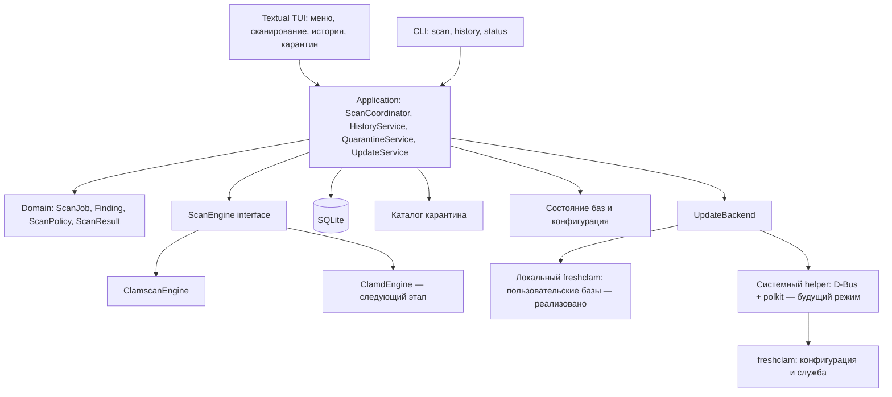

# Архитектура ClamUI для Linux Mint

Статус: целевая архитектура. Реализован сокращённый прототип, см. [README](../README.md).
Прототип использует стандартный curses вместо Textual и объединённое ядро core.py;
системное применение зеркал, карантин и прочие последующие этапы ещё не реализованы.
В прототипе 0.2 есть выбор файлов, дополнение пути, процент по фиксированному списку
и пользовательское обновление freshclam. Системный backend ниже — отдельный будущий режим.
Предположение: ClamUI — терминальная оболочка ClamAV с меню (TUI) и CLI-командами.
Целевая платформа первой версии: Linux Mint 22.x, независимо от Cinnamon/MATE/Xfce; SSH — после проверки терминальной совместимости. LMDE — отдельная матрица совместимости.

## Цели и границы

Проверка выбранных файлов и каталогов, понятные результаты, история проверок,
управляемый карантин, состояние и обновление антивирусных баз с выбором зеркал.
Режим «Только свои зеркала» исключает официальный источник и автоматический fallback к нему.
Приложение работает локально, без облачного сервера и телеметрии.
Постоянная защита при доступе к файлам, сканирование всей системы с root и
автоматическое удаление угроз не входят в первую версию.

## Технологические решения

| Область | Решение | Причина |
|---|---|---|
| Язык | Python 3 из дистрибутива | Простая интеграция с системными библиотеками |
| Интерфейс | Python + Textual | Терминальные меню, таблицы, формы, управление клавиатурой |
| CLI | argparse | Автоматизация и запуск без интерактивного терминала |
| Движок MVP | clamscan отдельным процессом | Не требует постоянно работающего clamd |
| Дополнительный движок | clamd через локальный Unix socket | Повторные проверки без загрузки баз при каждом запуске |
| Данные | SQLite через стандартный sqlite3 | Транзакции и локальная история |
| Настройки | TOML в XDG_CONFIG_HOME | Конфигурация без зависимости от рабочего стола |
| Фоновая работа | asyncio subprocess и выделенный worker для дисковых операций | UI не блокируется на процессе, файловом вводе-выводе или SQLite |
| Доставка | Нативный .deb | Доступ к системному ClamAV и интеграции рабочего стола |

TUI уменьшает зависимость от рабочего стола, но не отменяет сопровождение библиотек.
Textual изолирован в слое tui; ядро его не импортирует. Зависимости фиксируются для сборки.
Версии библиотек проверяются на минимальной поддерживаемой системе, а не по API
последних upstream-релизов. Flatpak не является основным форматом: доступ к
файлам хоста и системному демону требует отдельного проекта интеграции.

## Компоненты



Это модульное терминальное приложение, без собственного HTTP API и микросервисов.
TUI работает в главном asyncio loop. Адаптер асинхронно читает процесс сканера;
блокирующие файловые операции и SQLite выполняются в выделенном worker.
Соединение SQLite создаётся и используется только в этом worker.
События ядра преобразуются в Textual messages на границе TUI; обновления ограничены
по частоте. Заданием владеет application, а не экран: переход в историю не отменяет
сканирование. CLI использует те же сценарии без импорта Textual.

## Меню и взаимодействие

```text
ClamUI                                  Базы: состояние / дата

  > Проверить файлы или папку
    История проверок
    Карантин
    Базы и обновления
    Настройки
    Справка
    Выход

↑↓ Выбор   Enter Открыть   Tab Следующее поле   Esc Назад   F1 Помощь
```

Выбор цели — поле пути с дополнением и дерево каталогов, несколько целей.
Экран проверки показывает фазу, доступные счётчики, находки, ошибки и отмену.
Все действия доступны с клавиатуры; мышь необязательна. Опасные действия требуют
диалога с путём и названием операции, без заранее выбранного подтверждения.
Целевая геометрия — от 80×24; меньший размер показывает просьбу увеличить терминал,
сохраняя задание. Предусмотрены ASCII-оформление, режим без цвета и текстовые статусы.
Пути и сообщения сканера выводятся как данные: управляющие символы экранируются,
ANSI/OSC-последовательности и Rich markup из входных строк не исполняются.
Оригинальные пути хранятся отдельно от отображаемых значений.

Проектируемые команды (пока не реализованы):

```sh
clamui                             # меню
clamui scan -- ~/Downloads          # проверка без TUI
clamui scan --json -- ~/Downloads   # один итоговый JSON в stdout
clamui history                     # история
clamui status                      # состояние движка и баз
```

CLI: 0 — завершено без находок и известных пропусков; 1 — находки без ошибок;
2 — ошибка или неполная проверка, в том числе с находками; 130 — отмена по Ctrl+C.
JSON содержит отдельные поля для находок и полноты результата, версия схемы явная.
Диагностика идёт в stderr. Без TTY запуск без аргументов выводит справку.
Поддерживается `--no-color`. Одновременные изменяющие операции TUI/CLI запрещает
неблокирующий flock в приватном каталоге состояния; второй экземпляр сообщает
о занятом приложении. Чтение истории допускается отдельно.

## Контракты и жизненный цикл проверки

`ScanEngine` принимает `ScanRequest` и публикует события `ScanStarted`,
`FindingDetected`, `PathFailed`, `ScanProgress`, `ScanFinished`.
Контракт содержит `capabilities`, чтобы UI не предлагал неподдерживаемые настройки.
Не все параметры clamscan применимы к clamd: конфигурация демона принадлежит системе.

`ScanRequest`: идентификатор, абсолютные пути, рекурсивность, исключения,
политика символьных ссылок и точек монтирования, лимиты, выбранный движок.
`Finding`: исходный путь, имя сигнатуры, время, движок, снимок метаданных файла.
`ScanResult`: количество проверенных файлов, находки, ошибки, пропуски,
длительность, версия движка и баз, признак неполного покрытия.

Состояния задания: `queued → running → completed | failed | cancelled`.
Обнаружение угроз — результат проверки, а не ошибка выполнения.
Покрытие учитывается отдельно: завершённый процесс не гарантирует проверку всех файлов.
Задания, оставшиеся running после аварийного завершения приложения, становятся interrupted.

MVP выполняет одно задание за раз. Во время проверки интерфейс показывает текущую
фазу, время и доступные счётчики. Процент отображается только при достоверно известном
объёме; рекурсивной проверке без такого объёма соответствует неопределённый индикатор.
Выход через меню при активной проверке предлагает остаться либо отменить её.
Ctrl+C инициирует отмену; SIGHUP/SIGTERM — остановку собственного сканера и сохранение
частичного результата по возможности. После SIGKILL состояние восстанавливается
как interrupted при следующем запуске. TUI восстанавливает режим терминала при
штатном выходе и обрабатываемых исключениях. Проверки после закрытия терминала
в MVP не продолжаются; для длительной SSH-сессии можно использовать tmux.

## Адаптер clamscan

- Запуск subprocess с массивом аргументов, без shell; пути отделяются от опций через `--`.
- Явная политика перехода по symlink и файловым системам; специальные файлы не сканируются.
- Непрерывное чтение stdout/stderr, контролируемый размер диагностического журнала.
- Стабильная локаль процесса, версионированный парсер, сохранение неизвестных сообщений как диагностики.
- Коды завершения 0/1/2 нормализуются в отсутствие находок / находки / ошибку.
  Уже полученные находки не теряются при последующей ошибке.
- Текстовый вывод не считается надёжным идентификатором файла: необычные имена,
  включая переводы строк, требуют отдельной обработки. Неоднозначная строка не может
  разрешать перемещение или удаление файла; UI показывает диагностическое ограничение.
- Отмена: завершить собственную группу процессов, затем принудительно остановить по
  таймауту, прочитать оставшийся вывод и сохранить частичный результат.
- Недоступные пути, лимиты, исключения и прочие известные пропуски отражаются отдельно.
  Формулировка результата: «Угроз не обнаружено в проверенных файлах».

## Дополнительный адаптер clamd

Подключается только к локальному Unix socket. Доступность и права проверяются заранее.
Передача открытого файла через FILDES, где поддерживается, или INSTREAM позволяет
работать с файлами, доступными пользователю, без предположения о доступе демона к пути.
Приложение сохраняет собственное соответствие ответа исходному файлу, учитывает лимит
потока и ограничения сканера. Отмена прекращает отправку новых запросов; немедленная
остановка уже начатой проверки в демоне не гарантируется.
Fallback на clamscan допускается до начала задания с указанием движка в UI;
ошибка посреди задания не запускает незаметно повторную полную проверку.

## Права и обновление баз

### Реализованный пользовательский backend

Кнопка обновления запускает freshclam с отдельным временным конфигом в закрытом
каталоге `/tmp/clamui-freshclam-*` и `--datadir` в том же каталоге. В Ubuntu/Mint
AppArmor профиль freshclam разрешает файлы владельца в `/tmp/**`, но может запрещать
пользовательский XDG_STATE_HOME. Данные downloaded-процесса после проверки копируются
в staging под XDG_DATA_HOME/clamui и активируются атомарным указателем на том же
файловом разделе. Сохранённые зеркала применяются только к этой операции.
Конфигурация системы не читается для наследования источников и не изменяется.
Текущие базы копируются в staging; freshclam проверяет подписи и загрузку баз,
затем при успехе атомарно переключается указатель active-database. При неудаче
прежние базы сохраняются; freshclam.dat сохраняет интервалы повторов. Сканирование
явно получает --database с активным каталогом. До первого обновления читает системные базы.
Общий activity lock исключает проверку во время обновления. UI показывает источник
баз, реальный журнал и отмену. Файловый список сканирования сначала подсчитывается,
потом передаётся clamscan через --file-list: процент учитывает уникальные полученные
результаты, ошибки и пропуски отдельно. Неизвестные результаты не заменяются оценками.

### Будущий системный backend

Следующие требования относятся к управлению общей системной службой и не являются
условием пользовательского обновления. Выбор backend должен быть явным; смешивание
каталогов баз и конфигураций запрещено.

TUI и сканирующий процесс запускаются от обычного пользователя.
Нет доступа к файлу — запись о пропуске, без автоматического повышения привилегий.
ClamAV и базы устанавливаются средствами дистрибутива. При отсутствии баз
сканирование недоступно с понятным объяснением.
Обновлением владеет один системный freshclam: TUI не запускает конкурирующий процесс.
Редактирование профиля не требует root; его применение к системе и запрос обновления
выполняет узкий D-Bus helper с polkit. Для терминала без графического агента
предусмотрен текстовый агент авторизации; при его отсутствии доступен только просмотр
и редактирование черновика. TUI не получает и не хранит пароль администратора.
Настройка системных источников общая для всех пользователей, что явно указано в UI.

### Модель и границы модулей

- `UpdateProfile`: id, name, mode (`official` / `private_only`), список зеркал,
  автоматические обновления, checks_per_day, connect_timeout, receive_timeout.
- `MirrorEndpoint`: id, label, base_url, enabled. HTTPS по умолчанию; HTTP допускается
  при явном выборе для локального зеркала. URL с userinfo, управляющими символами,
  query/fragment и неподдерживаемыми схемами отвергается. Аутентификация зеркал вне v1.
- `UpdateService`: черновик, валидация, предварительный просмотр, применение, запрос
  обновления, статус. Состояния: draft → validated → applying → applied | failed.
- `UpdateBackend`: read_effective_config, validate_profile, preview_changes,
  apply_profile(expected_revision), request_update, get_update_status.
- `FreshclamConfigAdapter`: версия-зависимое преобразование профиля в директивы;
  неизвестная версия/неподдерживаемая возможность блокирует применение с объяснением.
- `SystemUpdateHelper`: проверка отправителя и polkit, системная блокировка,
  конфигурация и управление фиксированной службой. Не принимает shell-команды,
  произвольные пути, произвольные директивы и OnUpdateExecute/OnErrorExecute.
- `UpdateRun`: профиль и ревизия, время, использованный источник при известности,
  версии баз до/после, результат, диагностика. События обновления независимы от сканирования.

Профили-черновики хранятся в пользовательском TOML. Применённая ревизия и журнал
системных изменений — в root-owned `/var/lib/clamui/`; действующая конфигурация
freshclam является источником истины. TUI различает «сохранено», «применено» и
«внешние изменения», не выдаёт сохранённый переключатель за фактическое состояние.

### Режимы источников

| Режим | Источники freshclam | Поведение при недоступности |
|---|---|---|
| Официальный | DatabaseMirror database.clamav.net, штатная DNS-проверка | Ошибка с сохранением существующих баз |
| Только свои зеркала | Только включённые PrivateMirror, минимум одно | Другие разрешённые частные зеркала, затем ошибка; официальный fallback запрещён |

Переключатель «Официальные серверы: выключены» соответствует `private_only`.
Добавление зеркала само по себе не меняет режим. В v1 смешанный режим не поддерживается:
это исключает неоднозначность между резервным источником и полным отключением официального.
Резервные частные зеркала передаются freshclam; UI не обещает строгий порядок,
если конкретная версия freshclam его не гарантирует.

В private_only адаптер генерирует `PrivateMirror` вместо `DatabaseMirror`.
PrivateMirror переопределяет DatabaseMirror, DNSDatabaseInfo и ScriptedUpdates:
проверка версии через официальный DNS и инкрементальные scripted updates не используются.
Скомпилированная конфигурация не содержит активных официальных DatabaseMirror,
DNSDatabaseInfo или дополнительных DatabaseCustomURL. Старые дополнительные источники
показываются в diff и отключаются при применении, а не игнорируются.
Не использовать `DNSDatabaseInfo no` как универсальную команду отключения DNS.
Обычный DNS для разрешения имени своего зеркала остаётся нужен.

Пример фрагмента генерируемого freshclam.conf (не полный системный конфиг):

```text
PrivateMirror https://mirror.example.org/clamav
PrivateMirror https://backup.example.org/clamav
```

Адреса выше — заглушки. Формат URL/пути проверяется для установленной версии.
Зеркало должно раздавать совместимые базы ClamAV. Это выбор места загрузки подписанных
баз, а не разрешение произвольных неподписанных сигнатур. Проверка подлинности баз
остаётся включённой; ошибка подписи не запускает обход проверки или смену режима.
PrivateMirror может потребовать скачивания полных баз — это отражается в справке.

Гарантия режима относится к источникам, DNS-проверке и fallback, которыми управляет
freshclam. Она не является глобальным сетевым запретом для ОС: редирект зеркала,
прокси или внешняя правка службы могут изменить маршрут. Проверка зеркала выявляет
редиректы и отклоняет переходы на другой origin; HTTP redirects самого freshclam
проверяются на целевых версиях отдельно. До сетевого контроля назначения нельзя
обещать полное отсутствие любых пакетов к официальной инфраструктуре. Для строгой
изоляции необходим отдельный egress allowlist/контролирующий proxy; UI не называет
обычный профиль «сетевой блокировкой». Доступность зеркала не доказывает подлинность базы.

### Применение и восстановление

1. Проверить поля, наличие включённого зеркала и совместимость freshclam;
   показать системную область действия, diff и отключаемые источники.
2. После действия «Применить» авторизовать фиксированную операцию через polkit.
   Helper заново валидирует данные, берёт системную блокировку и сверяет ревизию.
3. Зафиксировать предыдущую конфигурацию и состояние службы; остановить текущий updater,
   дождаться выхода. Если нельзя установить единственного владельца баз — отказ.
4. Сгенерировать конфигурацию без произвольных пользовательских директив, проверить
   синтаксис способом, поддержанным целевой версией. Записать через временный файл,
   fsync и атомарную замену с сохранением системных прав. Не предполагать поддержку include.
5. Запустить службу с новой конфигурацией, сверить фактический профиль и состояние.
   «Применено» означает успешное применение, а не успешную загрузку новых баз.
6. При ошибке не включать официальные источники автоматически. Если предыдущий профиль
   нарушает новый запрет, оставить updater остановленным, сохранить базы, предложить
   исправить настройки либо явно вернуть прежний режим. Журнал фаз позволяет восстановить
   состояние после сбоя между заменой конфига и запуском службы.

Внешние изменения конфига или пакетного обслуживания обнаруживаются по ревизии;
несовпадение блокирует перезапись до повторного просмотра. Системный адаптер учитывает
владение конфигурацией пакетами Mint/Debian; управление расписанием и ручной запрос
обновления не создают второй freshclam. Во время сканирования уже загруженные базы
используются до завершения задания; обновлённый clamd перезагружает базы штатным механизмом.

## Данные и карантин

- `$XDG_STATE_HOME/clamui/history.sqlite3`: задания, находки, ошибки, журнал операций.
- `$XDG_DATA_HOME/clamui/quarantine/`: содержимое карантина с непрозрачными UUID-именами.
- `$XDG_CONFIG_HOME/clamui/config.toml`: предпочтения, исключения, параметры проверок.
  Версионированная схема; атомарная запись через временный файл. При отсутствии
  XDG-переменных используются стандартные каталоги внутри HOME.
- Каталоги приватны для пользователя (0700), файлы истории и карантина — 0600.
- SQLite использует миграции схемы; сроки хранения истории настраиваются.

Карантин включается только по явному действию пользователя. Перед перемещением
повторно проверяются тип файла и его идентичность; symlink не разыменовывается.
Изменившийся после проверки файл требует повторной проверки. Для архивов операция
относится к внешнему архиву, а не к виртуальному пути заражённого элемента.

Операции имеют журнал `pending → stored → source_removed → committed`:
для разных файловых систем сначала создаётся эксклюзивная копия в карантине,
проверяется хеш, синхронизируются данные, затем повторно проверяется исходник и
выполняется удаление. Если идентичность или безопасность операции нельзя подтвердить,
исходник остаётся на месте и операция отмечается неполной. БД и файловая система
не образуют общую транзакцию; при запуске выполняется восстановление по журналу.

При восстановлении проверяются каталог назначения и конфликт имён; существующий
файл не перезаписывается, права исполнения автоматически не возвращаются.
Постоянное удаление требует отдельного подтверждения.
Hard links и уже открытые дескрипторы могут оставлять содержимое доступным:
карантин не является песочницей и не гарантирует обезвреживание всех копий.
Работа с активно изменяемыми или чужими каталогами исключена из безопасного MVP-карантина.

## Структура проекта

```text
src/clamui/
  __main__.py
  bootstrap.py              # сборка зависимостей
  domain/                   # модели и правила, без Textual и subprocess
  application/              # сценарии, очередь заданий, координация
  ports/                    # ScanEngine, HistoryRepository, QuarantineStore, UpdateBackend
  infrastructure/
    engines/                # clamscan, позднее clamd
    persistence/            # SQLite и миграции
    quarantine/             # файловые операции и восстановление
    config/                 # TOML, XDG, валидация
    updates/                # FreshclamConfigAdapter, системный backend, профили
    system/                 # состояние баз, блокировка экземпляра
  tui/                      # Textual app, экраны, виджеты, TCSS
  cli/                      # argparse, текстовый и JSON-вывод
system-helper/              # D-Bus API, polkit policy, системная транзакция
data/                       # пример конфигурации, необязательный .desktop
po/                         # переводы gettext
packaging/debian/           # сборка .deb
tests/                      # unit, интеграционные и сценарии отказов
docs/architecture.md
```

Внутренние слои определяют интерфейсы, инфраструктура их реализует.
UI вызывает application, но не subprocess, SQL или файловые операции карантина.
Bootstrap связывает реализации; тесты подставляют fake engine и временное хранилище.

## Интеграция с Mint

Основной запуск — команда `clamui`. Необязательный desktop entry с `Terminal=true`
открывает меню из списка приложений. Зависимости .deb: Python, проверенная версия
Textual с зависимостями и clamscan из пакета clamav; freshclam рекомендуется,
clamd опционален. Если подходящего Textual нет в целевых репозиториях, пакет включает
частное окружение приложения с зафиксированными зависимостями, без изменения
системного Python и без скачивания через pip при запуске или установке .deb.
Nemo и desktop notifications — необязательная интеграция следующего этапа.

## Этапы и критерии готовности

1. Вертикальный MVP: ядро и CLI scan/status, меню Textual, выбор путей, clamscan, отмена, находки/ошибки,
   состояние баз, история SQLite, .deb.
2. Карантин: журнал файловых операций, восстановление после сбоя, конфликт имён,
   проверки изменившихся файлов; затем интеграция Nemo и уведомления.
3. Управление обновлениями: профили зеркал, private_only, предварительный просмотр,
   системный helper/polkit, запрос обновления, журнал и восстановление после сбоя.
4. Опциональные возможности: clamd, планирование через systemd --user timer и
   существующий CLI entrypoint.
   Планирование проектируется с защитой от пересечения заданий TUI и таймера.
   On-access protection требует отдельного решения и не подразумевается этапом 4.

Проверка качества: fake engine для автомата состояний, реальные интеграционные
проверки с безопасным тестовым файлом EICAR, недоступными путями, необычными именами,
повреждёнными/отсутствующими базами, отменой и падением процесса. Для карантина —
другая файловая система, нехватка места, подмена файла и сбой между стадиями журнала.
Проверка .deb в чистой VM Mint и ручной UI smoke test; русская/английская локаль,
светлый/тёмный терминал, управление клавиатурой, resize и 80×24, SSH/tmux,
Ctrl+C/SIGHUP, восстановление терминала, входные ANSI/OSC-последовательности.
CLI: проверка без TTY, stdout/stderr, JSON, коды завершения и конфликт экземпляров.

Дополнительные проверки обновлений: отказ polkit; пустой private_only; несколько зеркал;
битый URL; отказ TLS; повреждённая подпись; недоступность всех зеркал; отсутствие
официальных HTTP/DNS fallback; редиректы; параллельные пользователи; внешний edit;
сбой после остановки/записи/старта службы; отсутствие возврата к официальному режиму
при rollback. Интеграционные тесты в VM с контролируемыми DNS/HTTP и захватом трафика.
Синтаксис и поведение сверяются с freshclam из целевой Mint, а не только upstream main.

Полное дерево экранов и действий: [menu.md](menu.md).

## Первичные источники

- Textual: фоновая работа и доставка событий в UI:
  https://textual.textualize.io/guide/workers/
- Textual: дерево файлов и каталогов:
  https://textual.textualize.io/widgets/directory_tree/

- ClamAV: способы сканирования, процессы, протокол демона и ограничения:
  https://docs.clamav.net/manual/Usage/Scanning.html
- ClamAV: частные зеркала:
  https://docs.clamav.net/appendix/CvdPrivateMirror.html
- Каталог зеркал ClamUI (Microsoft, TrueNetwork, clamav-mirror.ru и официальный CDN):
  [docs/mirrors.md](mirrors.md)
- ClamAV: семантика PrivateMirror в конфигурации:
  https://github.com/Cisco-Talos/clamav/blob/main/etc/freshclam.conf.sample
- ClamAV: конфигурация clamd и freshclam:
  https://docs.clamav.net/manual/Usage/Configuration.html
- ClamAV: установка пакетов и начальная настройка:
  https://docs.clamav.net/manual/Installing/Packages.html
- Linux Mint: руководство разработчика:
  https://linuxmint-developer-guide.readthedocs.io/

Стек, границы модулей и этапы выше — проектные рекомендации, а не требования этих источников.
